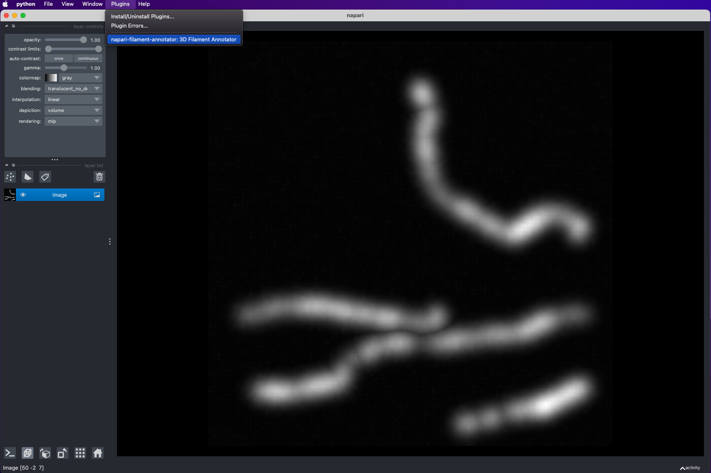
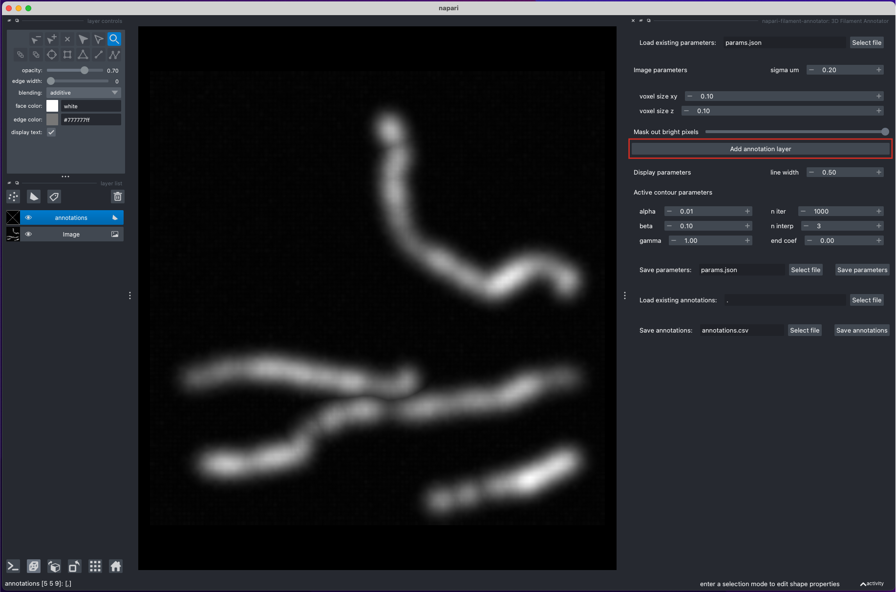

# 3D Filament Annotator

## Summary

3D Filament Annotator is a tool for annotating filaments and other curvilinear structures in 3D. 
The 3D annotation is done by annotating the filament in two different projections, 
calculating intersection, and refining the filament position with active contours.

## Intended Audience & Supported Data

The plugin is intended for annotation of filamentous structures from a 3D view. 
The main use-case are structures that are not visible in a single-slice image due to being
too thin or too low intensity. 

No expertise in image analysis is required to use this plugin, though a basic knowledge of 
active contours would be helpful to set the parameters.

The plugin expects single-channel 3D images as input. Time-series data are not yet supported.

## Quickstart

**1. Open example image**

**2. Start the 3D annotator plugin**

**3. Adjust image parameters**

Adjust the voxel size of the image and the Gaussian-smoothing sigma that will be used to smooth the image for active
contour refinement of filament position.

- Voxel size in xy and z
- Sigma um: smoothing sigma, microns (or the same units as used for the voxel size)

**4. Add annotation layer**

Click the "Add annotation layer" button to add a new Shapes layer for annotation.

This step might take several seconds, depending on the image size, due to some filtering 
that is performed behind the scenes.

**5. Annotate filaments**

1. Rotate the image to find a position, where the filament is clearly visible
2. Draw a line over the filament, by holding "Control" (or "Command" on macOS) and clicking with the mouse:
   this will draw a polygon with potential filament locations
3. Rotate the image to view the filament from another angle and repeat step 2
4. Rotate the image again: this will calculate the filament position from the intersection of the two polygons
5. Repeat steps 1-4 for other filaments

Hot keys to edit the annotations:

- `p`: delete the last added point (during the polygon drawing)
- `d`: delete the last added shape (polygon or filament)
- `f`: delete the first point of the last added filament
- `l`: delete the last point of the last added filament

**6. Save annotations**

Save final or intermediate annotations to a csv file.

There is an option to load previously annotated filaments and continue the annotation.

## Documentation 

For more details on the plugin functionality and tips for adjusting parameters,
please refer to the [Filamenter Annotator Tutorial](../docs/tutorial.md)

## Getting Help

If you encounter any problems, please 
[file an issue](https://github.com/amedyukhina/napari-filament-annotator/issues) 
along with a detailed description.

If you have a question, you can ask it in the 
[Discussion tab](https://github.com/amedyukhina/napari-filament-annotator/discussions) 
of the project.

## How to Cite

