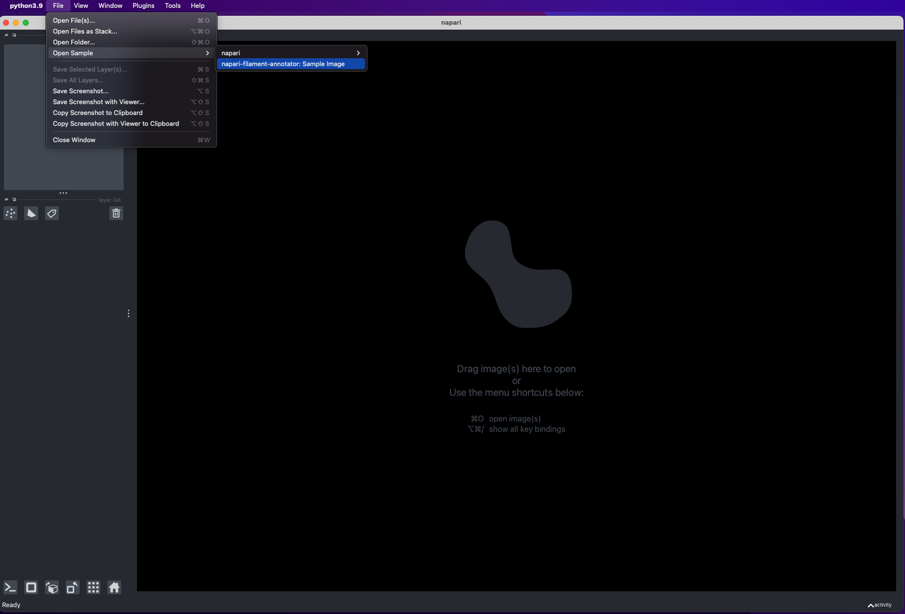
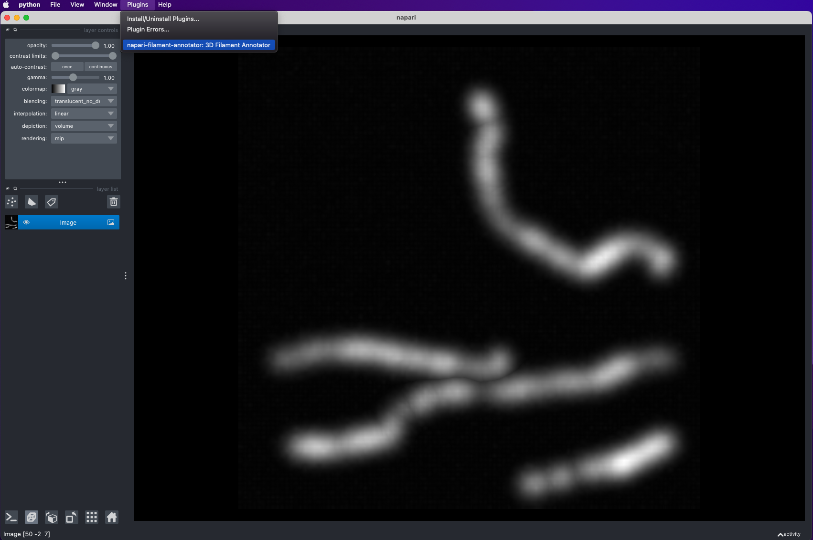
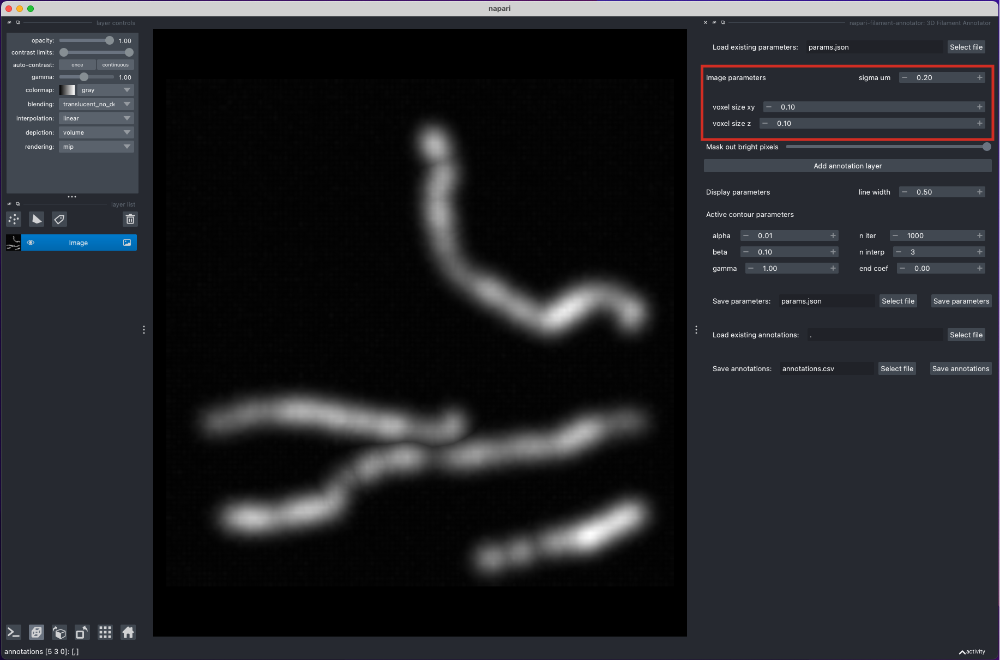
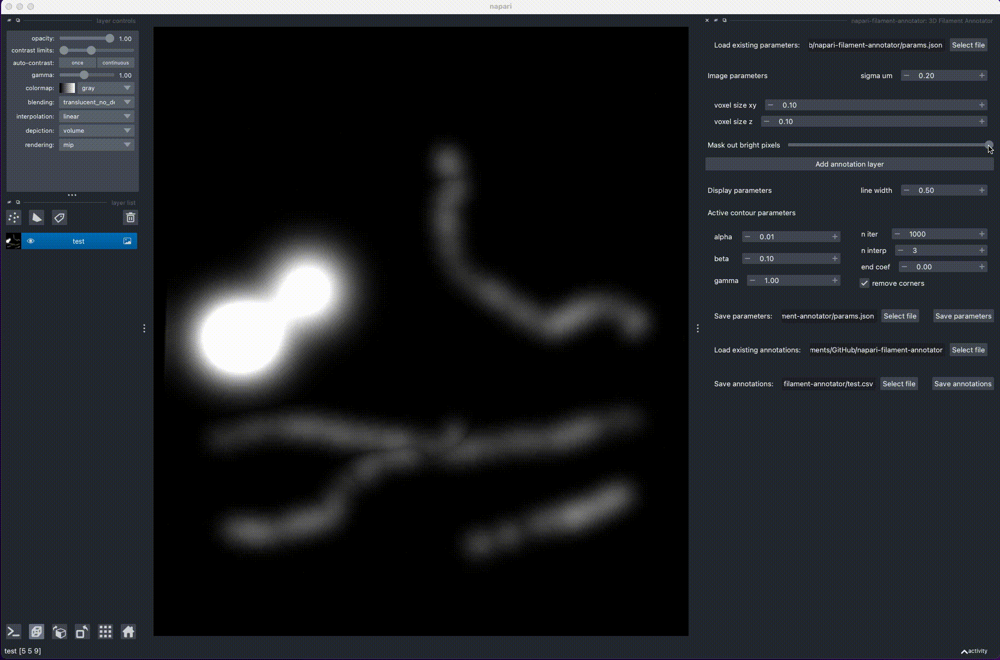
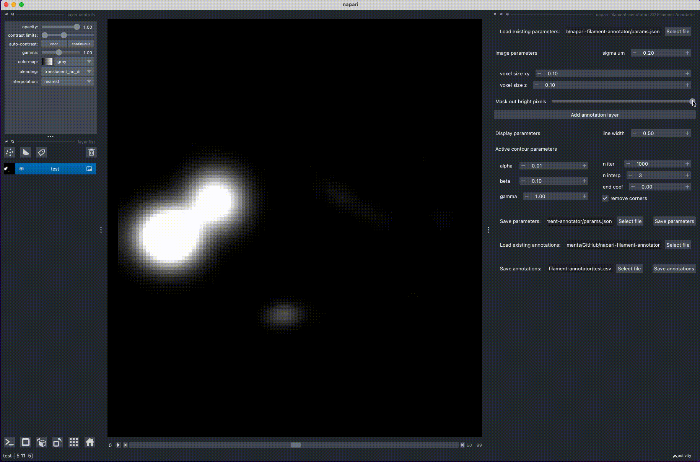
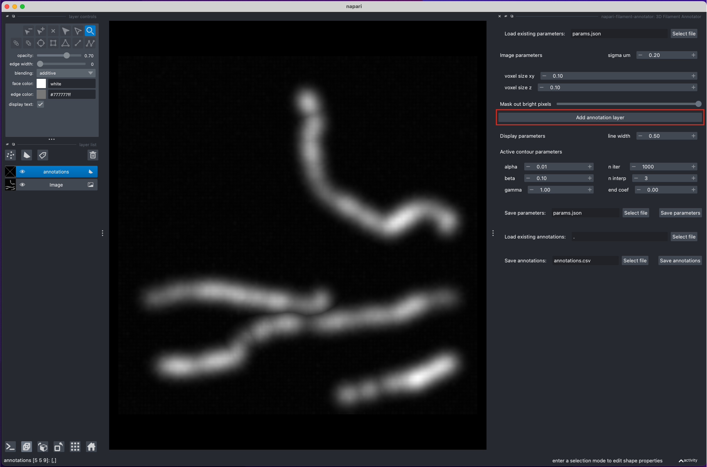
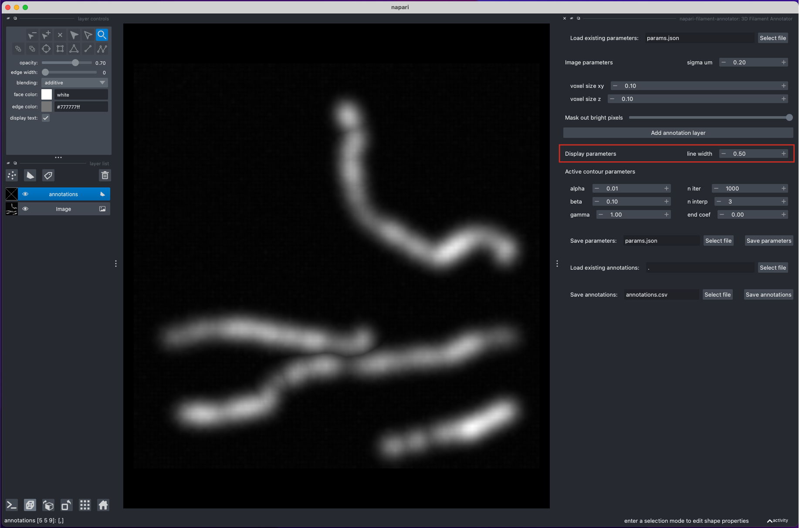
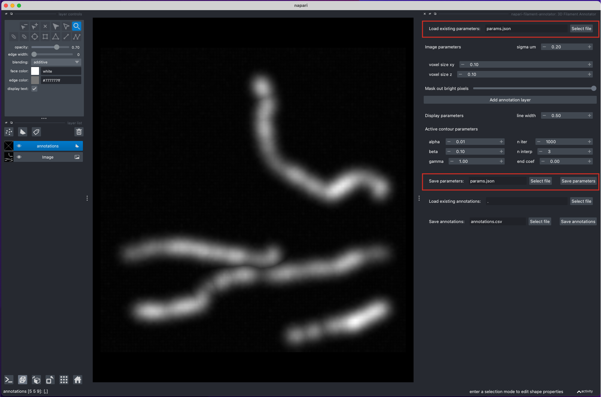
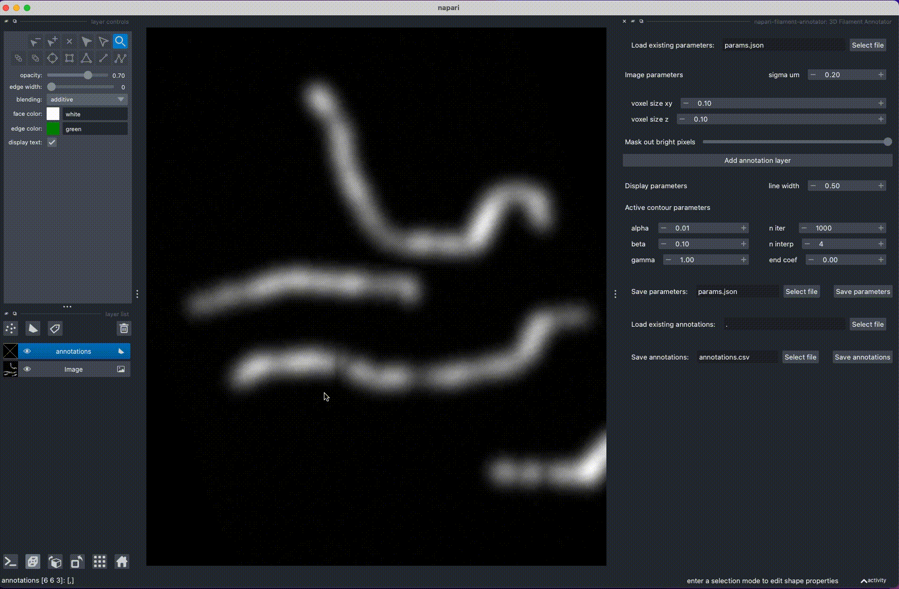

# 3D Filament Annotator: Usage

The filament position is calculated as intersection between annotations done in two different projections. The filament
position is then refined by the active contour.

###1. Open example image

###2. Start the 3D annotator plugin

###3. Adjust image parameters

Adjust the voxel size of the image and the Gaussian-smoothing sigma that will be used to smooth the image for active
contour refinement of filament position.

- Voxel size in xy and z
- Sigma um: smoothing sigma, microns (or the same units as used for the voxel size)

###4. Mask out bright parts of the image

If necessary, mask out parts of the image that are brighter than the target filaments by adjusting the slider for the
maximum image intensity. This is done to avoid the annotation being attracted to these bright parts during the active
contour evolution.

If necessary, switch to the 2D display mode for masking
(there is a know [issue](https://github.com/napari/napari/issues/4909) with updating the 3D view mode for large images
related to macOS with intel built-in GPU)

###5. Add annotation layer

Click the "Add annotation layer" button to add a new Shapes layer for annotation.

If you change the voxel size or smoothing sigma, you will need to add a new annotation layer, as the image smoothing and
gradient calculation is done only once when the new annotation layer is added.

Due to this filtering step, adding an annotation layer might take several seconds, depending on the image size.

###6. Adjust display parameters

Adjust the line width for the annotations.

###7. Adjust parameters for annotation refinement

- [Active contour](https://en.wikipedia.org/wiki/Active_contour_model#Energy_formulation) parameters:
    - alpha: active contour weight for the amount of stretch in the contour; large values penalize changes in the
      distances between points
    - beta: active contour weight for the amount of curvature in the contour; large values penalize corners and bending
    - gamma: active contour weight for the external (image) force; `gamma=1` corresponds to equal contribution of the
      image force (attraction to bright pixels) and internal force (contour smoothness); increase to prefer attraction
      to bright pixels, decrease to prefer a smoother contour
    - n_iter: number of iterations of the active contour
    - end_coef: coefficient between 0 and 1 to downweigh the force on the end points; set to 0 to fix the end points,
      set to 1 to freely evolve the end points

- Other parameters:
    - n_interp: number of points to add between each pair of annotated points for smoother contour refinement

###8. Save parameters for future annotation

There is an option to save all adjusted parameters to a json file to load for future annotation.

###9. Annotate filaments

1. Rotate the image to find a position, where the filament is clearly visible
2. Draw a line over the filament, by holding "Control" (or "Command" on macOS) and clicking with the mouse:
   this will draw a polygon with potential filament locations
3. Rotate the image to view the filament from another angle and repeat step 2
4. Rotate the image again: this will calculate the filament position from the intersection of the two polygons
5. Repeat steps 1-4 for other filaments

Hot keys to edit the annotations:

- `p`: delete the last added point (during the polygon drawing)
- `d`: delete the last added shape (polygon or filament)
- `f`: delete the first point of the last added filament
- `l`: delete the last point of the last added filament

###10. Save annotations

Save final or intermediate annotations to a csv file.

There is an option to load previously annotated filaments and continue the annotation.

## A few tips for annotation

1. If your images contain a lot of clutter that hinders visibility, and you only need to 
annotate a small part of the image, use Fiji or Slicer to mask out irrelevant parts.
   
2. If your images contain structure that are brighter than the structure that you want to
annotate, use the slider in the plugin 
   ([step 4](tutorial.md#4.-Mask-out-bright-parts-of-the-image)) to maks out the bright pixels 
   and prevent active contour from attracting to these bright pixels
   
3. After adjusting parameters for one image, 
   [save](tutotial.md#8.-Save-parameters-for-future-annotation) them to a json file and
   load for annotating other images from the same batch
   
4. Adjust the contrast in the image layer, and zoom in and out for better visibility of 
low-intensity filaments
   
5. Use hot keys to edit annotations; "d" to delete the last filament; 
   "f" to delete the first point of the last filament; 
   "l" to delete the last point of the last filament
   
6. If a filament "snaps" to the nearest brighter filament, 
   decrease or disable the "gamma" parameter, decrease the number of active contour iterations, 
   or disable the active contour by setting the number of iterations to 0.
   